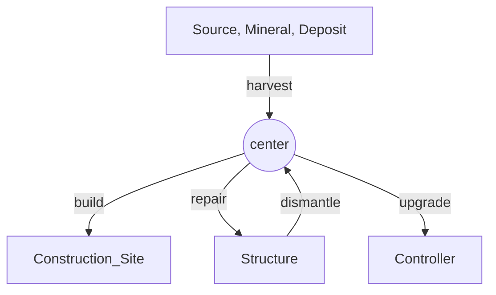

# 一个任务驱动的 `Screeps` AI

Code for game Screeps

> [Screeps Offical Websise](https://screeps.com/) [Screeps: World on Steam](https://store.steampowered.com/app/464350/Screeps_World/)
> 
> Screeps 是一款 MMORTS （大型多人在线即时战略游戏），和其他 RTS 游戏不同的地方在于，它需要你编写 `Javascript` 代码控制游戏中的单位采集、建造、运输和战斗
> 
> 更多详情：https://screeps-cn.github.io/introduction.html

本项目全局为任务驱动，`creep` 按照角色执行相应的任务。
其中 `lib/tasks` 为全局任务列表，`lib/posters` 通过它发布任务，`lib/executors` 领取并执行任务。

## 它如何工作

我们以 `worker` 为例解释任务驱动的工作方式。`tasks-screeps` 按照身体部件能够完成的动作来进行分类，所以将采集、升级、建造、维修和拆毁统一为 `worker` 进行管理。
这是一个 `worker` 的行动路线，其中箭头方向为资源的流动方向：



其中 `center` 结构在 4 级前为 `Spawn`，4 级后为 `Storage`。

## 一切皆任务

在 `tasks-screeps` 中是一切皆任务。`tasks-screeps` 中没有 `creeps` 数量控制模块，取而代之的是 `lib/posters/spawn` 模块，它控制着 `spawn` 任务的发布，而 `lib/executors/structure/spawn` 负责执行 `spawn` 任务。它们互不干涉，却共同维持着 `creep` 数量的恒定。

## 开发须知

你可以通过继承 `lib/tasks/base` 中的 `ManagerBase` 类编写你自己的全局任务管理器，并在 `interface` 中修改 `GlobalTasks` 向全局添加它。`ManagerBase` 能够自动排列任务的优先级，但默认按照添加时间排序，你需要重写 `compare` 方法自定义优先级。

## 安装使用

### 安装依赖

```shell
npm install
```

### 添加密钥

在根目录下新建 `.screeps.json` 文件，并填写密钥，它应该如下所示：

```json
{
  "email": "somebody@example.com",
  "token": "xxx-xxx-xxx-xxx-xxx-xxx",
  "branch": "default",
  "ptr": false,
  "server": "season"
}
```

### 编译文件

```shell
rollup -c
```

### 提交文件

```shell
grunt
```

## TODO

- [x] 完善任务分配逻辑，在同一 `tick` 中分配多个 `creep` 执行同一任务

- [ ] 分配同一 `carrier` 执行多个任务

- [ ] 强化 `carrier` 的作用，使其成为房间中的红细胞

- [ ] `carrier` 能够搬运地上的资源

- [ ] 完善 `tower` 的逻辑，包括攻击治疗和维修，道路的维修工作可以交给 `tower` 来完成

- [ ] 战斗逻辑：

  在战斗中取消任务分配的概念；

  必须确保每一个 `tick` 都进行动作。

  - [ ] 攻击逻辑：

    查看任务列表，获得最高优先级攻击对象，并朝它移动；

    扫描攻击范围内的所有对象，攻击优先级最高的对象。

  - [ ] 治疗逻辑：

    查看任务列表，获得最需要治疗的 `creep`，并朝它移动；

    扫描范围内的所有对象，治疗优先级最高的对象。
